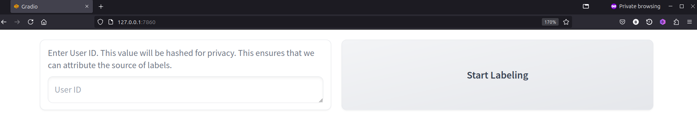

# hydrophone_labeller
A standalone command-line tool to label hydrophone data.

## Installation


Some functions in this library rely upon ffmpeg. If you are using anaconda, you may install it by using `conda install conda-forge::ffmpeg` or by downloading and installing it from the [official website](https://www.ffmpeg.org/download.html).

In an environment with python>=3.10 installed run:
```
pip install git+https://github.com/bnestor/hydrophone_labeller.git
```
To edit or add your own functionality you can install it from the source:
```
git clone https://github.com/bnestor/hydrophone_labeller.git
cd hydrophone_downloader
pip install -e .
```

## Usage

There are two core functionalities of this package. The first is to create normalised audio segments in mp3 format, alongside png images of the spectrogram. This reduces redundant computation during labelling.
```
hydrophone-labeller-prepare-data audio_files=<path/to/audio/files/*.flac> save_dir=</path/to/processed/flac>
```

The second core functionality is providing code to dynamically create a gradio app. This app can be shared with users with the link provided or deployed to huggingface.

```
hydrophone-labeller save_dir=</path/to/save/labels/to/> audio_files=</path/to/processed/outputs/*.mp3> classes=["orca","humpback","pacific white sided dolphin","sperm whale","sea lion"] instructions="label the species found in the file" 
```

To compile results into a csv you may run:
```
hydrophone-labeller-compile-labels save_dir=</path/to/save/labels/to/>
```

### Example 1: labelling for presence or absence of a marine mammals.

In this example, lets assume we have several directories with unlabelled data. These data are located in folders `/home/user/drive1/my orca_data/*.wav` and `/home/user/drive1/collaborator_orca_data/*.flac`. By ourself, or with others we wish to label all of these data. We can first, preprocess all of the data into spectrograms and compressed audio:

```
hydrophone-labeller-prepare-data audio_files=["/home/user/drive1/my orca_data/*.wav","/home/user/drive1/collaborator_orca_data/*.flac"] processed_output=/home/user/drive1/files_to_label/
```

However, by default it will produce snippets from 0 to 15 seconds. We can add some additional arguments (for example the most likely segment as predicted by a model) to select the 15 seconds which most represents that class. If your files are shorter than 15 seconds, ignore this step.

```
hydrophone-labeller-prepare-data audio_files=["/home/user/drive1/my orca_data/*.wav","/home/user/drive1/collaborator_orca_data/*.flac"] processed_output=/home/user/drive1/files_to_label/ segment_start_file=/path/to/inference/outputs.csv
```

Here, `outputs.csv` is a csv with a column, `filename`, which is the name of the file (full path is not necessary), and `start time`, which is the start time of the clip.

Now, `/home/user/drive1/files_to_label/` should have the following contents:
```
/home/user/drive1/files_to_label/
 -- file1.mp3
 -- file1.png
 -- collaborator_naming_scheme1.mp3
 -- collaborator_naming_scheme1.png
 ...
```

We are ready to label. We can create a link to an app running on our local machine using the following command:
```
hydrophone-labeller save_dir=/home/user/drive1/files_to_label/user_labels audio_files=/home/user/drive1/files_to_label/*.mp3 classes=["absent","present"] instructions="Label 'present' if a marine mammal is detected in the clip, otherwise label it 'absent'" 
```

this will return a link such as `http://127.0.0.1:7860/`. Following that link, you will see a webpage prompting a user_id. Enter a user ID that you can remember if you return to the application (such as <firstname>_<lastinitial>). This is to ensure the user does not label the same data again on revisits.



Upon clicking "start labelling" the first example will be shown


You will notice, that for this binary problem, there are some extra classes that are added by default. In particular, it does not make sense to have the `noise` and `multiple classes` buttons. We can override these defaults by passing a list of the default buttons. In your terminal, run `ctrl+c` to kill the session then launch it as follows:

```
hydrophone-labeller save_dir=/home/user/drive1/files_to_label/user_labels audio_files=/home/user/drive1/files_to_label/*.mp3 classes=["absent","present"] default_classes=["uncertain"] instructions="Label 'present' if a marine mammal is detected in the clip, otherwise label it 'absent'" 
```

Upon reopening the browser, following the link, and  providing a user_id, you will see something like the following:


If you would like to share the app with your collaborators so that they can help you label, you may create a temporary link by providing the `share=true` argument:

```
hydrophone-labeller save_dir=/home/user/drive1/files_to_label/user_labels audio_files=/home/user/drive1/files_to_label/*.mp3 classes=["absent","present"] default_classes=["uncertain"] instructions="Label 'present' if a marine mammal is detected in the clip, otherwise label it 'absent'"  share=true
```


## Coming soon
- Deploy to a huggingface space
- Compile results into a csv


